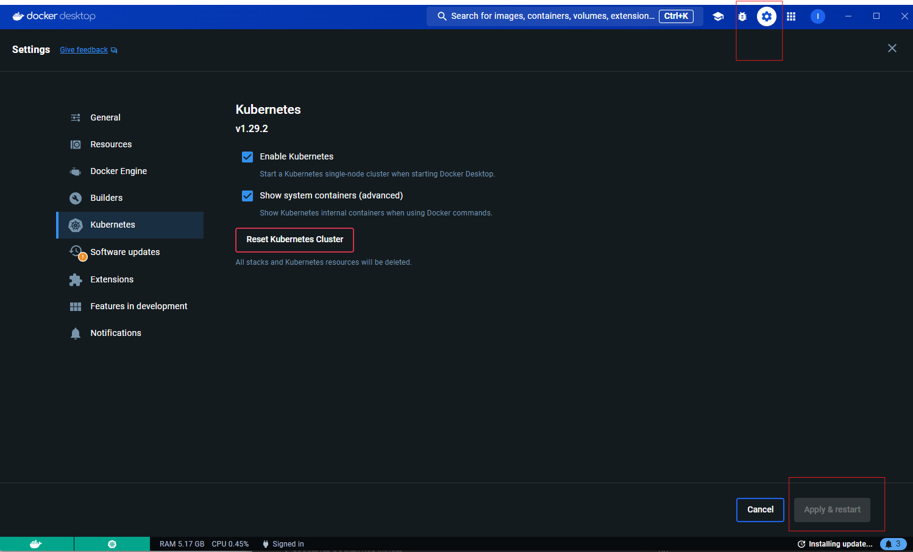
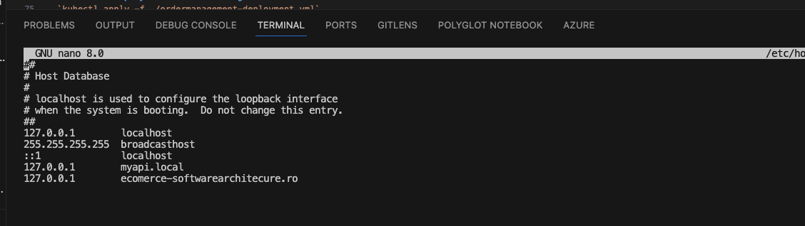

## Database setup 

### Prerequisites

`dotnet tool install --global dotnet-ef`

### Steps

Cd into /OrderManangement/OrderManagement

`dotnet ef migrations add InitialCreate --context OrderStateDbContext`

`dotnet ef database update --context OrderStateDbContext`

## Check container health status 

docker inspect --format='{{json .State.Health.Status}}' rabbitmq
docker inspect --format='{{json .State.Health.Status}}' mssql

## Opentelemetry - Jaeger

Make sure jaeger docker container is running - check compose.yml file infrastructure

1. Go to jaeger UI page: http://localhost:16686/
2. Select the service
3. Hit find traces. Remark: Find traces again, refresh does not bring the new data

## Kubernetes 

### Install Kubernetes

1. Make sure docker desktop is installed
2. Enable Kubernetes in docker desktop

3. Check if instalation ran succesfully
 -  run  `kubectl`
 -  check details `kubectl version --client=true -o yaml`
4. Check the cluster
- `kubectl get nodes`

5. Check kubectl config
- `kubectl config view`
### Setup Kubernetes dashboard locally

https://github.com/kubernetes/dashboard

https://gist.github.com/dahlsailrunner/1a47b0e38f6e3ba64d4d61835c73b7e2

### Install the dashboard 

kubectl apply -f https://raw.githubusercontent.com/kubernetes/dashboard/v2.4.0/aio/deploy/recommended.yaml

### Create an admin user 

`kubectl apply -f admin-user.yaml`

### Create a token for accessing the dashboard

`kubectl -n kubernetes-dashboard create token admin-user`

### Proxy to the dashboard

`kubectl proxy`

### Navigate to 

http://localhost:8001/api/v1/namespaces/kubernetes-dashboard/services/https:kubernetes-dashboard:/proxy/

See all contexts 
`kubectl config get-contexts`

Switch to corect context
`kubectl config set-context docker-desktop`

`kubectl config use-context docker-desktop`

## Kubernetes  Deployments
Cd into the kubernetes folder.

### Create deployment for SQL Server

`kubectl apply -f ./mssql-deployment.yml`

### Create deployment for Rabbit
`kubectl apply -f ./rabbit-deployment.yml`

### Create deployment for OrderManagement

- If the changes not seen in the new image make sure cache is disabled when building the image: `docker-compose build ordermanagement --no-cache`

`kubectl apply -f ./ordermanagement-deployment.yml`

### Endpoint slices

`kubectl get endpointslices`

#### Check the ordermanagement swagger

http://localhost:30000/swagger/index.html

### Create deployment for Inventorymanagement
Make sure the inventoryManagement image is build
CD into the root folder where the docker.compose.yml is
- Run : `docker-compose build inventorymanagement`

- Cd into the kubernetes folder
- `kubectl apply -f .\inventorymanagement-deployment.yml`
- 

### Remove deployment 

`kubectl delete -f ./ordermanagement-deployment.yml`

### Set image pull policy to make sure the images are pulled from local 

` imagePullPolicy: Never`

### Check the pods

`kubectl get pods`

### Check logs for a pod

`kubectl logs rabbitmq-df7dd796f-p4fx8`

### Check service configuration

`kubectl describe svc ordermanagement`

## Ingress Controller

Install the comunity ingress controller:

`kubectl apply -f https://raw.githubusercontent.com/kubernetes/ingress-nginx/controller-v1.10.5/deploy/static/provider/cloud/deploy.yaml`

Check the status of the controller pod

`kubectl get pods -n ingress-nginx -l app.kubernetes.io/name=ingress-nginx`

Check ingress classes

`kubectl get ingressclass`
`kubectl describe ingressclass nginx`

### Provide a host 

#### Windows:
 add a hosts entry in the hosts file
#### Macos:
`sudo nano /etc/hosts`

### Run the pod
`kubectl apply -f ingress.yml`

You can find it under ingresses in thee dashboard.
The nodeport can be removed form the ordermanagement. The ingress access it internally
`kubectl get ingress`

### Remove the ingress
`kubectl delete -f  .\ingress.yml`

## Docker

### Build a single image from a compose file 
`docker-compose build ordermanagement`
